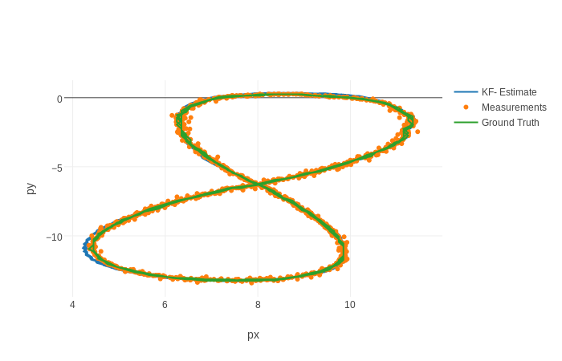
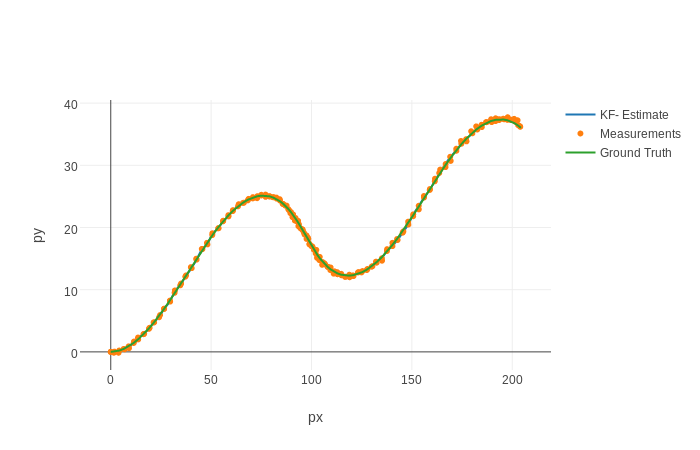
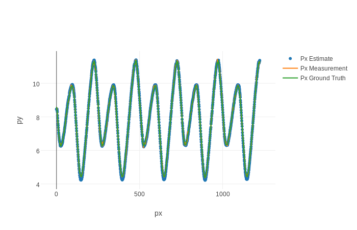
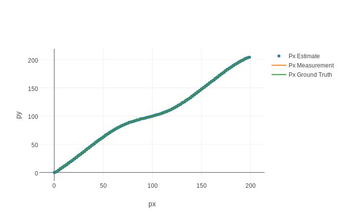
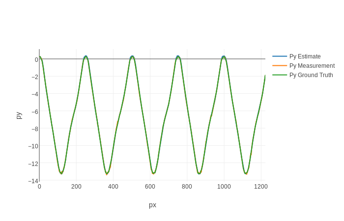
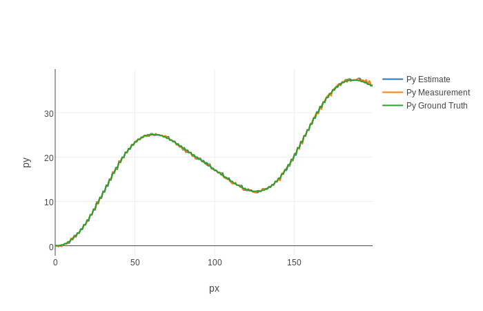
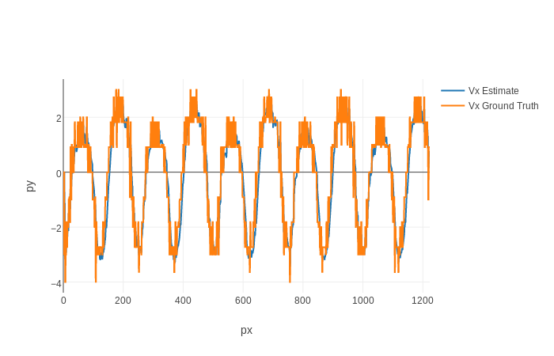
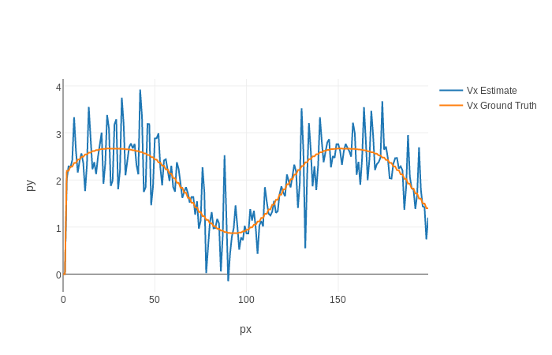
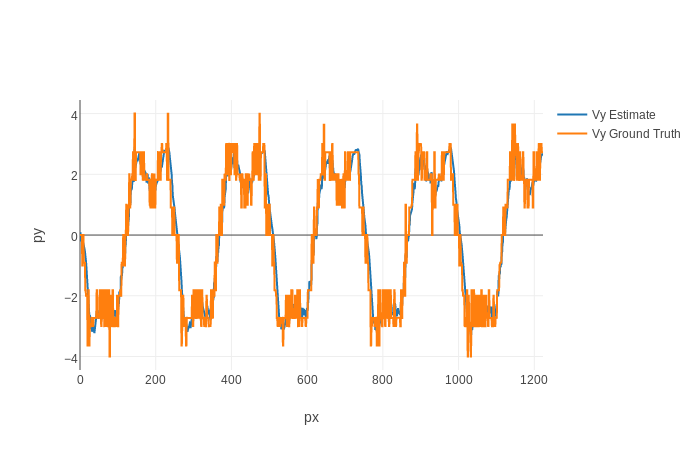
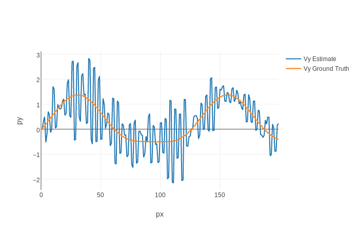

# Project 1: Extended Kalman Filters

## Project Basics
In this project, a system for tracking position using Extended Kalman Filters using radar and lidar data is implemented. The program will predict object position using radar and lidar measurement data. All source code are in the 'src' folder.

## Build instructions

Assuming you have 'cmake' and 'make' already:

1. Clone this repo.

2. Make a build directory: 

    `mkdir build && cd build`

3. Compile: 

    `cmake .. && make`

## Running the Project
Run it: `./ExtendedKF path/to/input.txt path/to/output.txt`. You can find some sample inputs in 'data/'. For example,

`./ExtendedKF ../data/sample-laser-radar-measurement-data-1.txt ./output_1.txt`

`./ExtendedKF ../data/sample-laser-radar-measurement-data-2.txt ./output_2.txt`

## Prediction Results
The results for input files `sample-laser-radar-measurement-data-1.txt` and `sample-laser-radar-measurement-data-2.txt` are:

| Test 1 Estimate            | Test 2 Estimate                                           |
| -------------------------- |----------------------------------------------------------|
|      |    |

| Test 1 px            | Test 2 px                                           |
| -------------------------- |----------------------------------------------------------|
|      |    |

| Test 1 py            | Test 2 py                                           |
| -------------------------- |----------------------------------------------------------|
|      |    |

| Test 1 vx            | Test 2 vx                                           |
| -------------------------- |----------------------------------------------------------|
|      |    |

| Test 1 vy            | Test 2 vy                                           |
| -------------------------- |----------------------------------------------------------|
|      |    |

| Test 1 RMSE            | Test 2 RMSE                                           |
| -------------------------- |----------------------------------------------------------|
| px=0.065165, py=0.06053, vx=0.533212, vy=0.54419  |px=0.18566, py=0.19027, vx=0.47452, vy=0.81114  |

