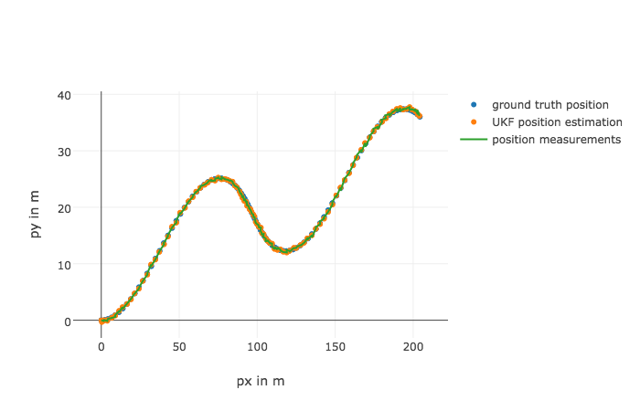

# Unscented Kalman Filter
In this project an Unscented Kalman Filter is utilized to estimate the state of a moving object of interest with noisy lidar and radar measurements. The code will make a prediction based on the sensor measurement and then update the expected position. See files in the 'src' folder for the primary C++ files making up this project.

---

## Content of this repo
- `scr`  a directory with the project code:
  - `main.cpp` - reads in data, calls a function to run the Kalman filter, calls a function to calculate RMSE
  - `ukf.cpp` - the UKF filter itself, defines the predict function, the update function for lidar, and the update function for radar
  - `tools.cpp` - a function to calculate RMSE
- `data`  a directory with two input files, provided by Udacity
- `result`  a directory with output files

## Build instructions
Assuming you have 'cmake' and 'make' already:
1. Clone this repo.
2. Make a build directory: `mkdir build && cd build`
3. Compile: `cmake .. && make`
4. Run it: `./UnscentedKF path/to/input.txt path/to/output.txt`. You can find some sample inputs in 'data/'.
   * eg. `./UnscentedKF ../data/obj_pose-laser-radar-synthetic-input.txt output.txt`
   

## Results
Based on the provided data set, the UKF system predicts: x-position('px'), y-position ('py'), velocity in the x-direction ('vx'), and velocity in the y-direction ('vy'). Residual error is calculated by mean squared error (MSE).

## Results and Visualization
1. Test 1 file: sample-laser-radar-measurement-data-1.txt
1. Test 2 file: sample-laser-radar-measurement-data-2.txt

| Test 1 Estimate            | Test 2 Estimate                                           |
| -------------------------- |----------------------------------------------------------|
|      |    |

| Test 1 px            | Test 2 px                                           |
| -------------------------- |----------------------------------------------------------|
|      |    |

| Input1 |   RMSE   |
| ----- | ------- |
|  px   | 0.075822 |
|  py   | 0.084218 |
|  vx   | 0.632344 |
|  vy   | 0.580668 |

Threshold: RMSE <= [0.09, 0.09, 0.65, 0.65]

| Input2 |   RMSE   |
| ----- | ------- |
|  px   | 0.194559 |
|  py   | 0.189894 |
|  vx   | 0.518945 |
|  vy   | 0.507547 |

Threshold: RMSE <= [0.20, 0.20, 0.55, 0.55]

