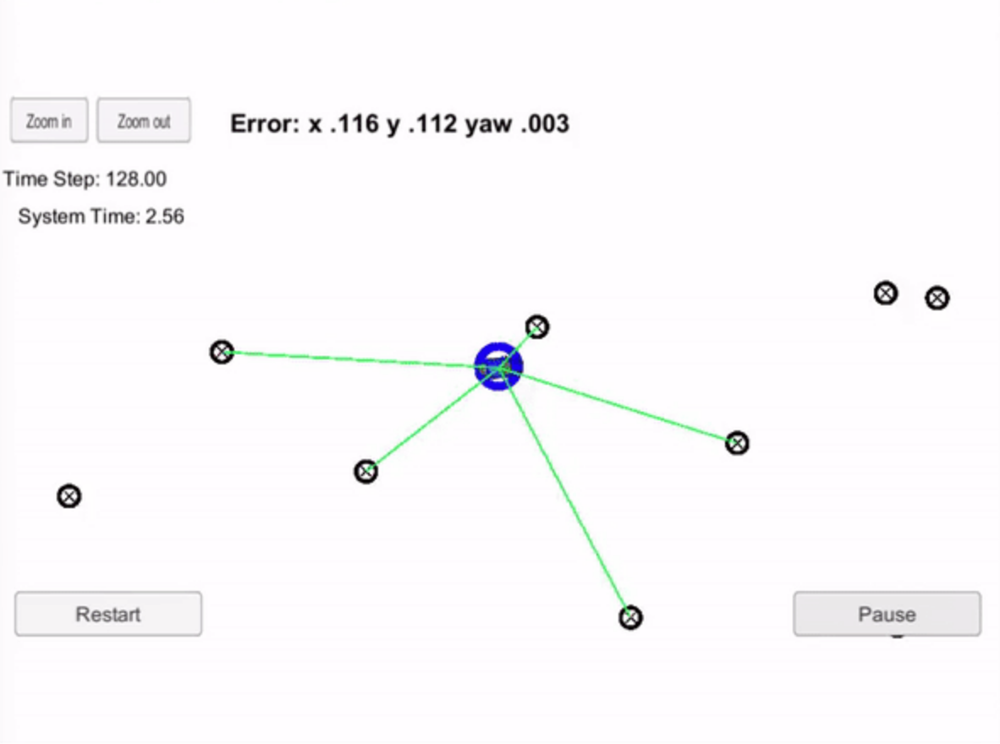
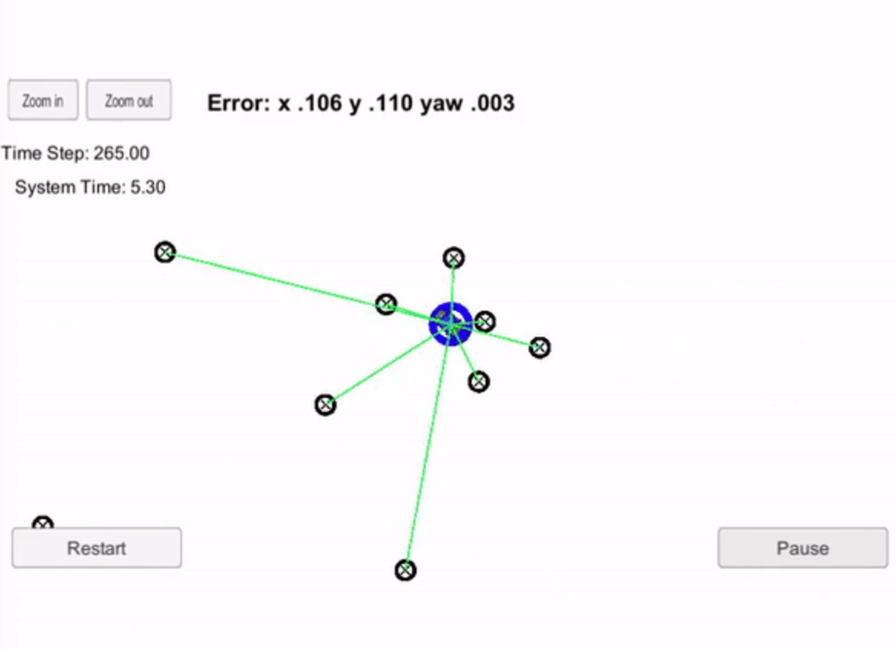
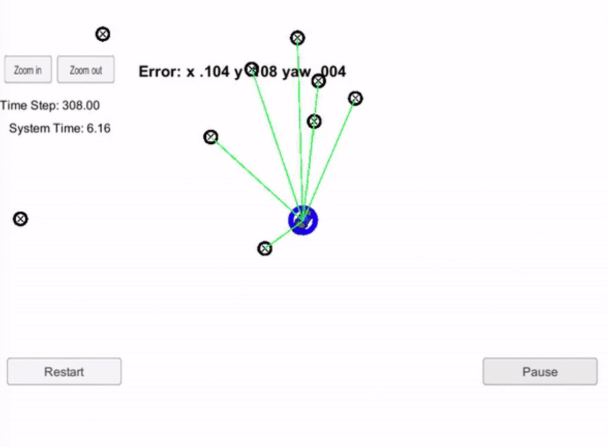
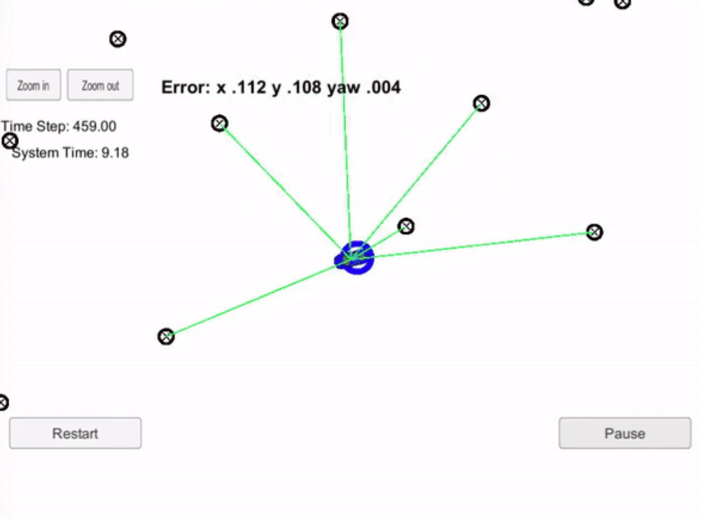

# Kidnapped Vehicle Localization

### Objective
In this project, a real-time particle filter is implemented to localize the vehicle with the sensor data.

At the beginning, particle filter will be given:

* a map with landmarks
* some initial localization information (very uncertain)
* noisy landmark obdservations 

The system estimates the location of the vehicle with noisy sensor data. The framework of the entire system can be explained as:

## Build and run the code
Assuming you have 'cmake' and 'make' already:

1. Clone this repo.
2. Make a build directory: `mkdir build && cd build`
3. Compile: `cmake .. && make`
4. Run it: `./particle_filter`

## Inputs to the Particle Filter
You can find the inputs to the particle filter in the `data` directory. 

#### The Map*
`map_data.txt` includes the position of landmarks (in meters) on an arbitrary Cartesian coordinate system. Each row has three columns
1. x position
2. y position
3. landmark id

### All other data the simulator provides, such as observations and controls.

> * Map data provided by 3D Mapping Solutions GmbH.

## Result

1. **Accuracy**: your particle filter should localize vehicle position and yaw to within the values with cumulative mean weighted error as follows:

| Estimation |   Error Value  |
| ----- | ------- |
|  x    | 0.112341 |
|  y    | 0.101859 |
|  yaw   | 0.003668 |

2. **Performance**: the particle filter completes execution within 2.12 sec. Several states are displayed as follows:

| Screen shot 1            | Screen shot 2  |
| -------------------------- |----------------------------------------------------------|
|      |    |

| Screen shot 3          | Screen shot 4                   |
| -------------------------- |----------------------------------------------------------|
|      |    |

Explanation:

* blue circle: real-time estimation of the vehicle's location and heading orientation

* blue car: ground truth of the vehicle (position and heading orientation)

