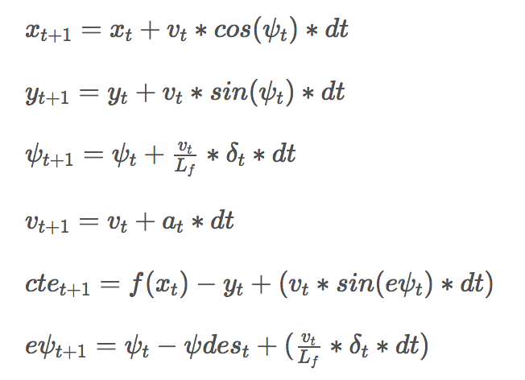

# Model Predictive Controller 

## Summary

In this project, a model predictive control modes is implemented to navigate the car drives around a simulator track. The model computes steering and acceleration commands and sends back to the simulator. The simulator provides a feed of values containing the position of the car, its speed and heading direction. It also provides the coordinates of waypoints along a reference trajectory that the car is to follow. Additionally, there's a latency between actuations commands on top of the connection latency.

## The Model

The model includes the vehicle's x and y coordinates, orientation angle (psi), and velocity, as well as the cross-track error and psi error (epsi). 

  * position of waypoints on the track (`ptsx`,`ptsy`)
  * vehicle position (`px`, `py`)
  * vehicle orientation (`psi`)
  * vehicle velocity (`v`)
  * vehicle steering angle (`delta`)
  * vehicle throttle (`a`)
  
Actuator outputs are acceleration and delta (steering angle). The model combines the state and actuations from the previous timestep to calculate the state for the current timestep:





**Timestep Length and Elapsed Duration**

The prediction horizon, `T`, is the duration over which future predictions are made. `T` is the product of two other variables, `N` and `dt`. `N` is the number of timesteps in the horizon, and `dt` is how much time elapses between actuations. For example, if `N` were 20 and `dt` were 0.5, then `T` would be 10 seconds.

In the project, I chose `N` for 25 and `dt` for 0.05. Thus, the optimizer is considering a 1.25 second duration to determine a corrective trajectory. In theory, the `N` should be as a large number and `dt` should be very small. Other values tried include 10 / 0.125,  20 / 0.1, 30 / 0.15, 50 / 0.075, and the combination of 25 / 0.05 works best for me.

**Polynomial Fitting and Preprocessing**

The waypoints are preprocessed by transforming them to the vehicle's perspective. First, each of the waypoints are adjusted by subtracting out px and py accordingly such that they are based on the vehicle's position. Next, the waypoint coordinates are changed using standard 2d vector transformation equations to be in vehicle coordinates:

```
    ptsx_car[i] = x * cos(-psi) - y * sin(-psi)  
    ptsy_car[i] = x * sin(-psi) + y * cos(-psi)
```


This simplifies the process to fit a polynomial to the waypoints because the vehicle's x and y coordinates are now at the origin (0, 0) and the orientation angle is also zero. 


**Account for Latency**


In a real car, an actuation command won't execute instantly - there will be a delay as the command propagates through the system. A realistic delay might be on the order of 100 milliseconds. This is a problem called "latency", For model predictive coontrol, the time elapsed between when you command a steering angle to when that angle is actually achieved. The model accounts for the simulator's added 100ms latency between the actuator calculation (when the model tells the car to perform a steering/acceleration/deacceleration command) and when the simulator actually perform that action. When update `a` and `delta`, a latency is included into the model.
